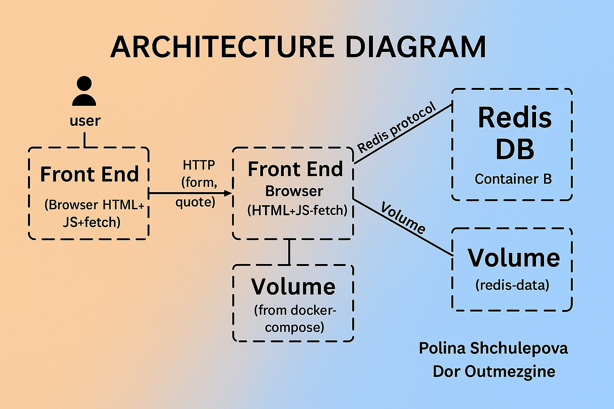

# DevOps-Project-Assignment
GitHub, Docker, and Docker-Compose Task

# DevOps Project: Inspirational Quote App

This project is a small web application built with Python and Flask that lets users get and add quotes.  
The quotes are saved in a Redis database, and every time you refresh the page, you get a random quote.

The application has two main parts:
- One part that displays a random quote
- Another part that lets you add new quotes using a simple  HTML form

Everything runs in Docker containers – both the app and the Redis database – and you can open the app with one simple command using Docker Compose.

# Project Structure

DevOps-Project-Assignment/

 app.py                    
 Dockerfile                
 docker-compose.yml        
 requirements.txt         
 templates/
   add_quote.html          
 README.md                  

### Running the Project ###

# Prerequisites
- Docker
- Docker Compose

# Build & Run

1. Clone the repository from GitHub:  
   Open your terminal (or Git Bash on Windows) and run:
   git clone https://github.com/your-org/DevOps-Project-Assignment.git
   cd DevOps-Project-Assignment
   

2. Build and run the application using Docker Compose: 
   This command builds both the Flask app and Redis services, and runs them together:
   docker compose up --build

3. Access the application from your browser:
   Once the app is running, open your browser and go to:
   - Form page to add new quotes: [http://localhost:5000/form](http://localhost:5000/form)
   - See a random quote: [http://localhost:5000/quote](http://localhost:5000/quote)

4. Stop the app when you're done:
   Press `Ctrl + C` in the terminal to stop the running containers.  
   If you want to fully remove the containers and network:
   docker compose down

# Technologies Used
- Python 
- Flask
- Redis
- Docker & Docker Compose
- HTML + JavaScript

# Contributions per team member

This project was developed by two team members:

Polina Shchulepova: app.py-`/quote`, Dockerfile , README.md , requirements.txt
Dor Outmezgine: Docker Compose, Redis volume , HTML form , app.py-`/add-quote`

# Data Persistence

Redis data is persisted using Docker volumes defined in docker-compose.yml:
This ensures quotes are not lost even when the containers are stopped or restarted.

# Architecture Diagram

